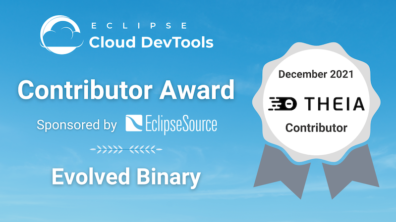

+++
date = "2021-12-13"
title = "Eclipse Cloud DevTools Contributor Award: Improving the Migration Guide for Eclipse Theia"
summary = "The Eclipse Cloud Developer Tools contributor award this month goes to Evolved Binary for improving the migration guide and process for Eclipse Theia."
category = "blog"
+++
The Eclipse Cloud Developer Tools contributor award this month goes to [Evolved Binary](https://www.evolvedbinary.com/) for improving the migration guide and process for Eclipse Theia. As representatives, we want to acknowledge Charafeddine Cheraa, Duncan Paterson and Adam Retter. Congratulations and thanks for your contributions!

Let us look at the details of this great contribution and its background. [Eclipse Theia](https://theia-ide.org/) is a platform for building web-based tools and IDEs. It helps you efficiently develop and deliver multi-language Cloud & Desktop IDEs and tools with modern, state-of-the-art web technologies. As a platform, Theia is adopted by multiple parties to build their own custom tool offerings (see [here](https://theia-ide.org/) for a list of adopters).

The Theia project is very active and delivers a release each month. This allows for a fast pace of innovation. Many core adopters that are also regular contributors integrate new versions very early in the process to evaluate new releases and provide initial feedback. In this process, necessary migration steps are discovered and often discussed among the committers. We call these core adopters “early adopters”.

However, the broader Eclipse Theia adopter base consists of projects that follow a much slower update strategy. This makes perfect sense. If you build a commercial tool offering based on Theia, which many vendors do, you do not need or want to upgrade every month. This type of adoption is actually much more common. We therefore call them “regular adopters”.For this type of adopter, necessary adaptations of new Theia versions can actually pile up over time. These necessary adaptations often also involve updates to underlying technologies, such as Webpack or JavaScript. 

The issue that Evolved Binary discovered is that the information and experience gathered by the early adopters was actually not being made available for use by regular adopters. While the Theia project maintains a detailed change log, including any breaking changes, there was no document that collected the migration experience of adopters. Therefore, regular adopters had to rediscover the necessary steps during their migration. And, even worse, every adopter had to repeat this exercise.

**How did Evolved Binary contribute to a solution to this problem?**
Very simple: They reported the issue! After contacting the project leads, they joined the [weekly Theia developer meeting](https://github.com/eclipse-theia/theia/wiki/Dev-Meetings). There, they provided details of the issues and discussed potential solutions with the community. There were several great ideas on how to improve the situation, many of which are already in place. The most important one is probably the creation of a shared migration guide. This guide will be started during the development of a release. What is now new, is that it will also now be added to by adopters (especially the early adopters) to capture migration knowledge gathered during the adoption of new releases. This builds up a shared resource of information that all adopters can contribute to and benefit from. So if you are an adopter of Theia, please have a look at the [migration guide](https://github.com/eclipse-theia/theia/blob/master/doc/Migration.md) and of course, please contribute to it!

So this award is assigned for reporting an issue? Absolutely yes! There are many things you can contribute to an open source project, with the most obvious one being source code. However, providing feedback is at least as important. This is especially true for a platform like Theia with so many adopters. It is hard for the core team to understand the needs of the so called “dark matter”, meaning unknown adopters not frequently in contact with the team. Raising issues in a constructive way, providing necessary details and even ideas how to solve issues allows projects to improve, from which all adopters benefit. Therefore, we want to thank Evolved Binary, especially Charafeddine Cheraa, Duncan Paterson and Adam Retter, for their great contribution and congratulate them for winning the Eclipse Cloud Developer Tools contributor award this month!

*This Eclipse Cloud Developer Tools contributor award is **sponsored by [EclipseSource](https://eclipsesource.com/)**, providing [consulting and implementation services](https://eclipsesource.com/services/tools/) for [web-based tools](https://eclipsesource.com/web-and-cloud-based-tools/) and [Eclipse Theia](https://eclipsesource.com/technology/eclipse-theia/).*
