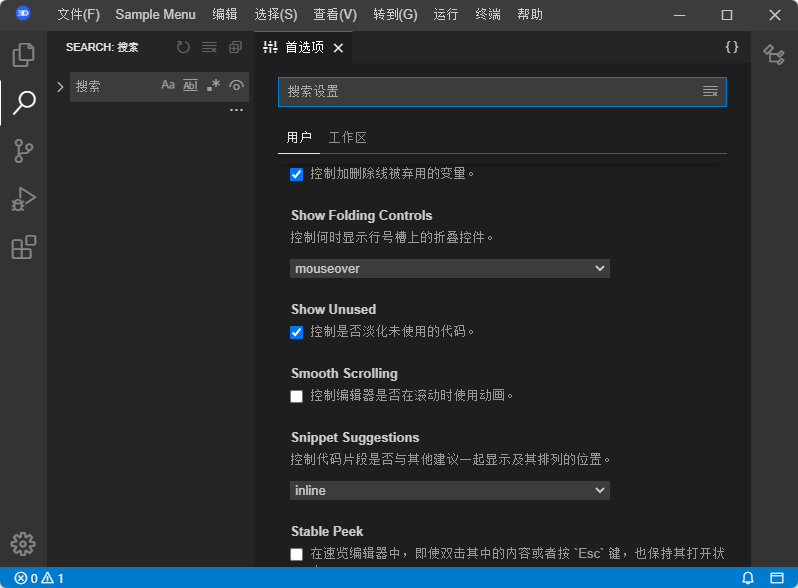

+++
date = "2021-12-16"
title = "Internationalization in Eclipse Theia"
summary = "Even though some attempts by contributors have been made in the past, as of mid 2021 still Theia had no support for different locales. Arduino has addressed this with  the all new Arduino IDE based on Theia. Having supported Arduino previously with their IDE, they tasked TypeFox with contributing this feature to Theia."
category = "blog"
+++
*This post was written by **Mark Sujew**, Software Engineer at TypeFox*

## What?
Internationalization (i18n) aims to provide the necessary infrastructure in an application to translate it into different languages/locales. It has been a frequently requested feature for Theia, especially considering that most modern software supports different locales in one way or another.

## Why?
Even though some attempts by contributors have been made in the past, as of mid 2021 still Theia had no support for different locales. Arduino has addressed this with  the all new [Arduino IDE](https://github.com/arduino/arduino-ide) based on Theia. Having supported Arduino previously with their IDE, they tasked [TypeFox](https://www.typefox.io/) with contributing this feature to Theia.

## Implementation Positives and Challenges
Of course, the main technical inspiration for this feature has been VSCode’s i18n implementation. In short: Inside of VSCode, every user-facing string is translated using a 'localize' function call that accepts a key and the English default value. A special build process reads these function calls and extracts every key and default value into a JSON file. These files are then translated, and each placed inside of a dedicated VSCode extension, dubbed as a "Language Pack".

To keep the maintenance effort for Theia as low as possible, the i18n feature supports VSCode's language packs to localize Theia. The main challenge here was correctly identifying the keys used in VSCode and using them to translate Theia. Luckily, after going through the process of finding them all, around 85% of Theia was already translated by simply installing a VSCode language pack.

Localizing the monaco-editor and the extension host were also challenges. The former uses an index based approach for localization instead of using string keys, while the latter uses the 'vscode-nls' package, whose inner workings are only sparsely documented, requiring some reverse-engineering.

## What's Next?
With Theia version 1.19, most of the framework is translated using language packs, while strings that are custom to Theia are still only available in English. Going into the next months, we plan to integrate a translation pipeline into Theia’s development process and thereby localize Theia into the most commonly used languages.

You can try it out by opening [Theia in Gitpod](https://gitpod.io/#https://github.com/eclipse-theia/theia) or cloning and compiling it yourself. After installing a language pack of your choice by searching for the language in the extensions tab and downloading it from the Open-VSX registry (see [Chinese](https://open-vsx.org/extension/MS-CEINTL/vscode-language-pack-zh-hans) or [French](https://open-vsx.org/extension/MS-CEINTL/vscode-language-pack-zh-hans)), run the `Configure Display Language` command and select your desired language. Theia will automatically reload itself and you'll be presented with a translated user interface.



Theia with a partial Chinese locale



## How to Get Involved?
As always, feedback and questions regarding Theia features are appreciated. The easiest way to do that is by filing a [feature request issue](https://github.com/eclipse-theia/theia/issues/new?assignees=&labels=&template=feature_request.md) or creating a [Q&A discussion](https://github.com/eclipse-theia/theia/discussions), respectively on GitHub. Be aware that text that is custom to Theia is not yet translated. This will be addressed in the following months.
