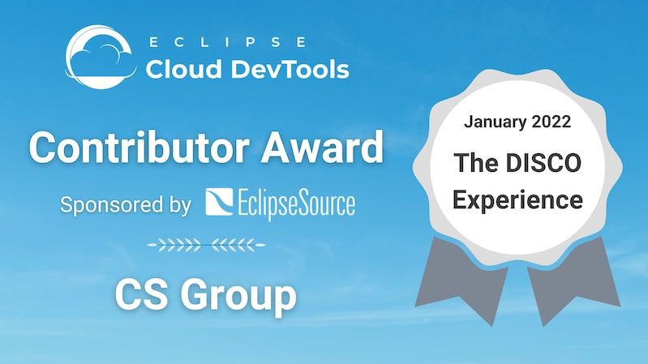

+++
date = "2022-01-12"
title = "Eclipse Cloud DevTools Contributor Award: The DISCO Experience"
summary = "The Eclipse Cloud Developer Tools contributor award this month goes to CS Group, represented by Vincent Hemery, for DISCO which is a modeling tool for satellite databases built with Eclipse Theia."
category = "blog"
author = "Brian King"
email = "briks.si@gmail.com"
+++
We would like to recognize [CS Group](https://www.csgroup.eu) (represented by Vincent Hemery), as the Eclipse Cloud DevTools Contributor of the Month for January 2022. Congratulations and thanks for your contributions!

Vincent currently leads the implementation of a new web-based front-end for DISCO. DISCO is a modeling tool for satellite databases. The new DISCO version adopts [Eclipse Theia](https://theia-ide.org/), [Eclipse GLSP](https://www.eclipse.org/glsp/), [EMF.cloud](https://www.eclipse.org/emfcloud/), [JSON Forms](https://jsonforms.io/) and [Xtext](https://www.eclipse.org/Xtext/). For more details, we recommend watching the great talk Vincent gave at EclipseCon 2021. You can find the recording below.

Vincent is the kind of adopter every open source project wishes for. He raises high-quality feature requests and bug reports. He provides technical details about his use cases and joins the discussion to design a solution. And finally, he often also puts in the effort to contribute to the actual development of the open source project. This really enables a mutual benefit between adopters and the team of committers of the respective projects. In particular, he has made significant contributions to the EMF.cloud project, especially the model server component, while influencing its architecture over time with his thoughtful feedback.

One of Vincent's key contributions is that he actively shares his experiences with other potential adopters. By giving great talks at EclipseCon and TheiaCon, he provides insights about his use case and focuses on lessons learned with the underlying technologies. These kinds of experience reports are rare, but an invaluable contribution to the ecosystem.

For these and other contributions, we would like to congratulate Vincent for this month’s Eclipse Cloud DevTools contributor award!



<iframe width="560" height="315" src="https://www.youtube-nocookie.com/embed/Qvuzu0QoUg0" title="YouTube video player" frameborder="0" allow="accelerometer; autoplay; clipboard-write; encrypted-media; gyroscope; picture-in-picture" allowfullscreen></iframe>





<iframe width="560" height="315" src="https://www.youtube-nocookie.com/embed/T2r05Ti50Bc" title="YouTube video player" frameborder="0" allow="accelerometer; autoplay; clipboard-write; encrypted-media; gyroscope; picture-in-picture" allowfullscreen></iframe>



*This Eclipse Cloud Developer Tools contributor award is **sponsored by [EclipseSource](https://eclipsesource.com/)**, providing [consulting and implementation services](https://eclipsesource.com/services/tools/) for [web-based tools](https://eclipsesource.com/web-and-cloud-based-tools/), [EMF.cloud](https://www.eclipse.org/emfcloud/), [JSON Forms](https://jsonforms.io/), [Eclipse GLSP](https://eclipsesource.com/technology/eclipse-glsp/) and [Eclipse Theia](https://eclipsesource.com/technology/eclipse-theia/).*
